# Data

-Data Source: https://www.cdc.gov/cancer/uscs/dataviz/download_data.htm

-Description: 

1. 1999-2015 
2. 50 States and different counties
3. 24 Million Cancer Cases
4. Age, Sex, Race
5. Cancer Site
6. Data gets reported from hospitals, physicians and labs across U.S.  to central cancer registries supported by CDC and NCI

# Data

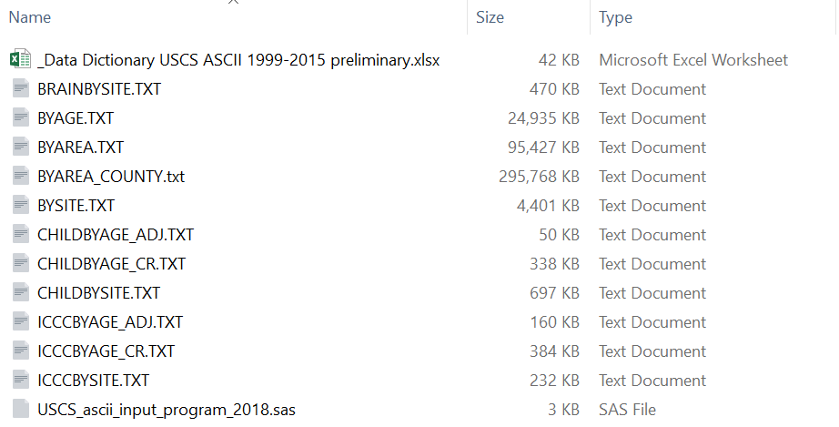\

# Data Example : BYAREACOUNTY

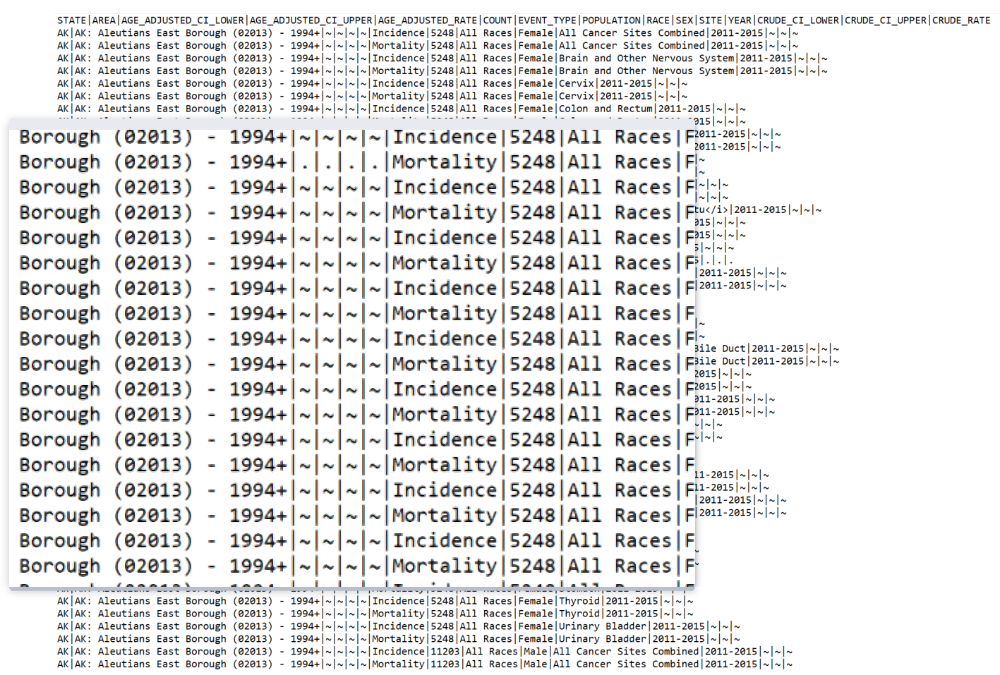\

# Terms

1. Incidence:
"Total number of new cancer cases diagnosed in a specific year in the population category of interest, divided by the at-risk population for that category and multiplied by 100,000 (cancers by primary site)"

2. Mortality:
"Total number of cancer deaths during a specific year in the population category of interest, divided by the at-risk population for that category and multiplied by 100,000"

3. Age Adjusted Rate:
The number of cases (or deaths) per 100,000 people and are age-adjusted to the 2000 U.S. standard population (19 age groups – Census P25–1130)

-Ensures that differences in incidence or deaths from one year to another, or between one geographic area and another, are not due to differences in the age distribution of the populations being compared

# Hypotheses

1. Between 2011-2015 the rate of cancer in rural areas should be lower than urban areas.

2. The mortality rate of cancer in elderlies are higher than the other age groups.

3. There's an association between the death rate of skin cancer and different ethnicities.

4. Males are more prone to new cancers than females.

5. Rate of new cancers during the 1999-2015 should increase.

# I. Between 2011-2015 the rate of cancer in rural areas should be lower than urban areas

1. Zahnd, W. E., James, A. S., Jenkins, W. D., Izadi, S. R., Fogleman, A. J., Steward, D. E., . Brard, L. (2018). Rural-Urban differences in cancer incidence and trends in the United States. Cancer Epidemiology Biomarkers and Prevention. http://doi.org/10.1158/1055-9965.EPI-17-0430

Summary: _The article describes that although the combined incidence rates were higher in urban areas, their decline was also greater than the rural populations. Most of the discrepancy were related to tobacco-associated, HPV-associated, lung and bronchus, cervical, and colorectal cancers across the population groups._

# I. Between 2011-2015 the rate of cancer in rural areas should be lower than urban areas - All Cancer Sites 
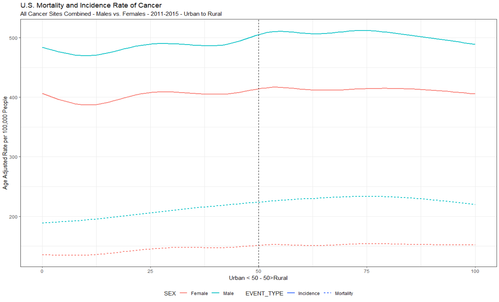\

# I. Between 2011-2015 the rate of cancer in rural areas should be lower than urban areas - Lung and Bronchus

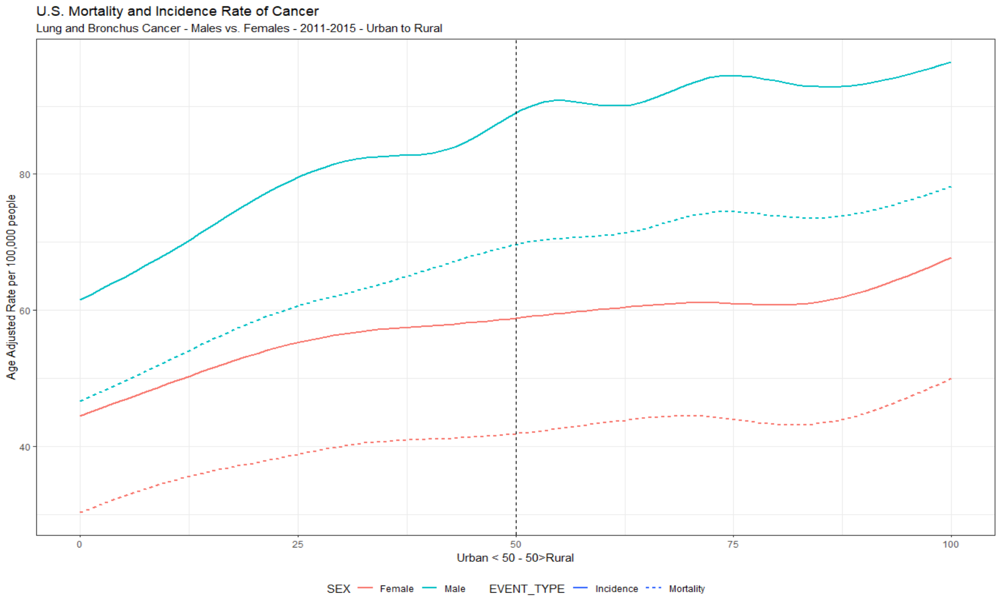\

# I. Between 2011-2015 the rate of cancer in rural areas should be lower than urban areas - Colon and Rectum

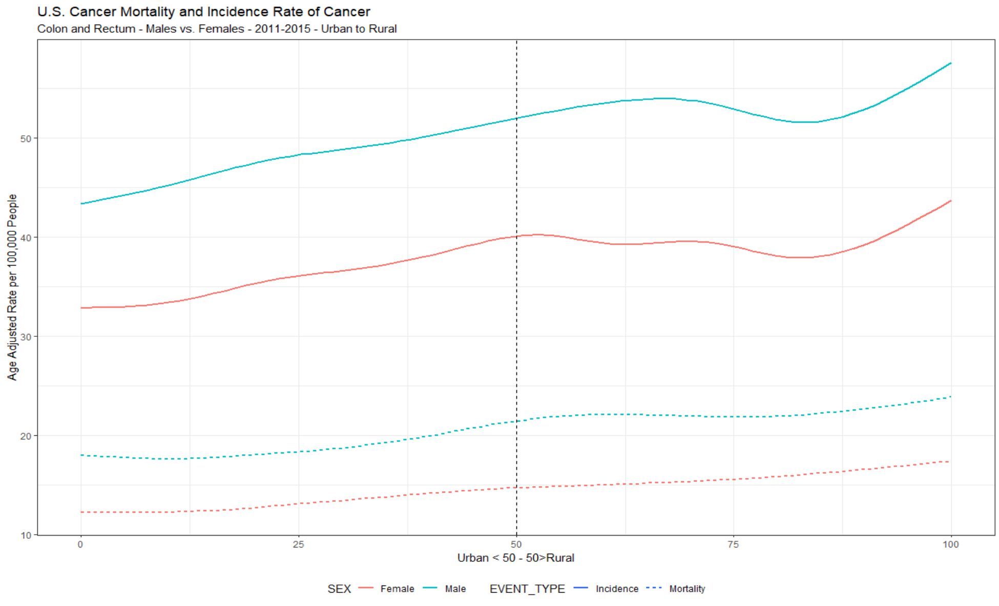\

# II. The mortality rate of cancer in elderlies are higher than the other age groups

2. White, M. C., Holman, D. M., Boehm, J. E., Peipins, L. A., Grossman, M., & Jane Henley, S. (2014). Age and cancer risk: A potentially modifiable relationship. American Journal of Preventive Medicine. http://doi.org/10.1016/j.amepre.2013.10.029

Summary: _After midlife the frequency of several cancer risk factors and the incidence rate begin to increase._

# II. The mortality rate of cancer in elderlies are higher than the other age groups

-Elderlies: 65-85+ vs. Non-elderlies: <1-65

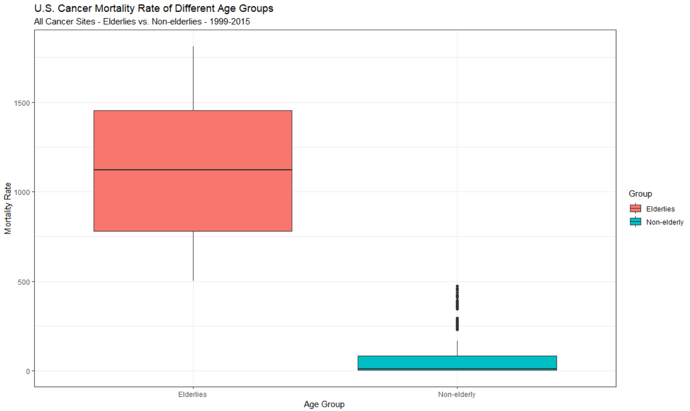\

# II. Death per Incidence - Elderlies vs. Non-elderlies

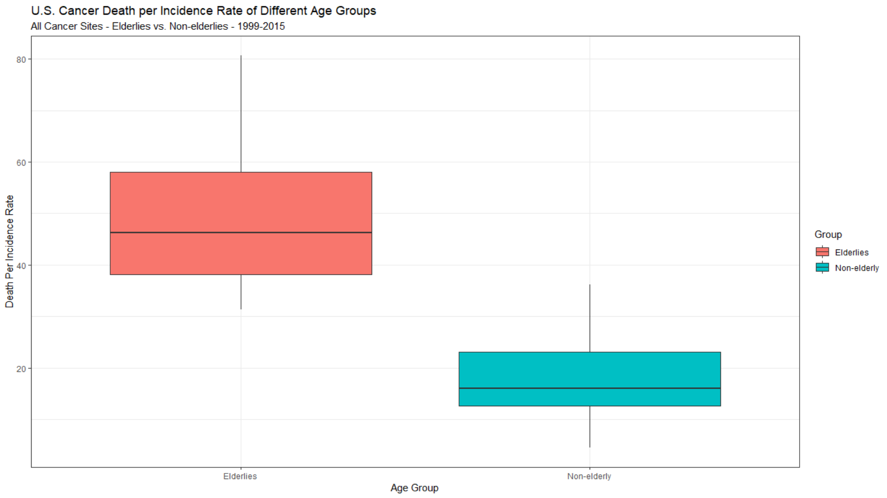\

-Elderlies	46.29571			
-Non-elderly	15.99335

# II. Death per Incidence - All Age Groups

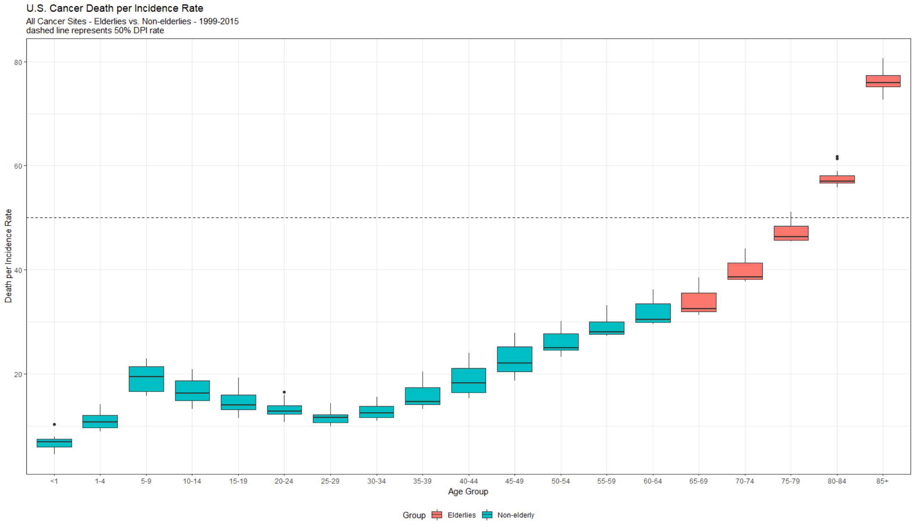\

-dpi rate of the "25-29" group is the lowest between "5-85+"

# III. There's an association between the death rate of skin cancer and different ethnicities

3. Ward-Peterson, M., Acuna, J. M., Alkhalifah, M. K., Nasiri, A. M., Al-Akeel, E. S., Alkhaldi, T. M., Dawari, S. A., . Aldaham, S. A. (2016). Association Between Race/Ethnicity and Survival of Melanoma Patients in the United States Over 3 Decades: A Secondary Analysis of SEER Data. Medicine, 95(17), e3315.

Summary: _The age groups of 18+ were diagnosed with primary cutaneous melanoma from 1982 to 2011. Considering the cause specific mortality and controlling for stage and site, non-Hispanic Black ethnicity had a lower Hazard Rate compared to other populations such as non-Hispanic Whites._

# III. There's an association between the death rate of skin cancer and different ethnicities

1. Melanomas of the Skin
2. Other Non-Epithelial Skin
3. Skin excluding Basal and Squamous

# III. There's an association between the death rate of skin cancer and different ethnicities

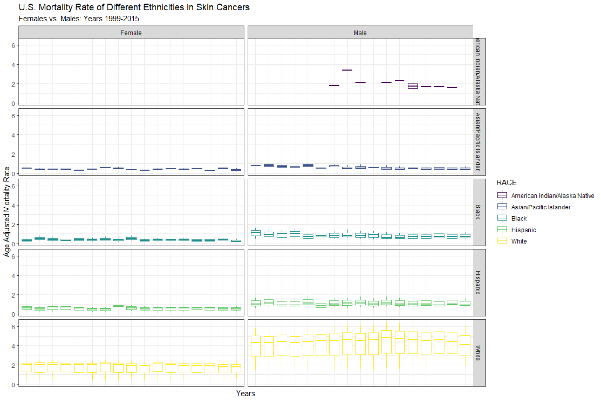\

# III. There's an association between the death rate of skin cancer and different ethnicities

-Better visualization and including data for American Indian/Alaska Natives

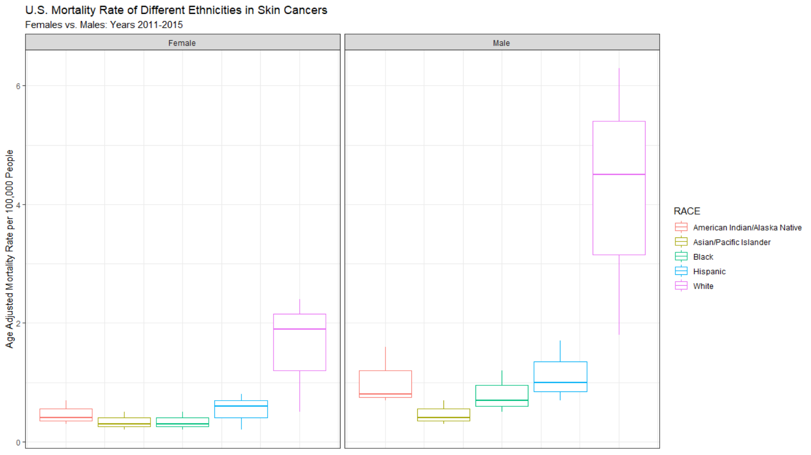\

# IV. Males are more prone to new cancers than females

4. Siegel, R. L., Miller, K. D., & Jemal, A. (2019). Cancer statistics, 2019. CA: A Cancer Journal for Clinicians. http://doi.org/10.3322/caac.21551

Summary: _According to the article, all sites combined in 2011-2015, the incidence rate of Males are 494.8 compared to the 419.3 of the Females. Units are per 100,000 population and age adjusted to the 2000 US standard population._

# IV. Males are more prone to new cancers than females

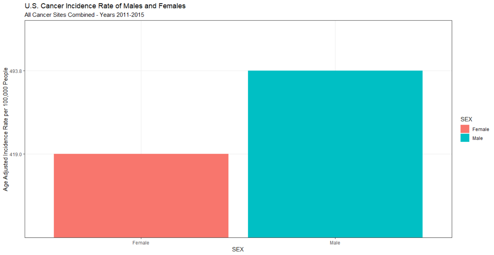\

Median:

-Female	419.0			
-Male	493.8	

# IV. Males are more prone to new cancers than females - per site

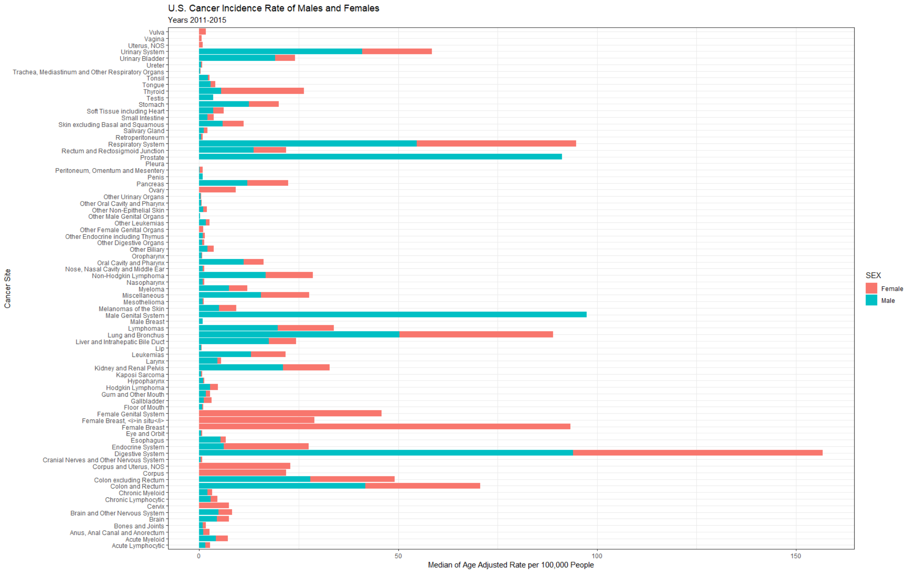\

-Thyroid cancer female incidence rate is actually higher than males

# IV. Thyroid Cancer

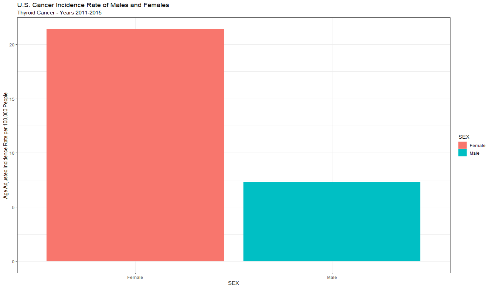\

# IV. Thyroid Cancer
Median:

-Female	21.4   -Male	7.3

This is further proven by many research papers done on the gender disparity of thyroid cancer. (Rahbari, R., Zhang, L., & Kebebew, E. (2010). Thyroid cancer gender disparity. Future oncology (London, England), 6(11), 1771-1779. doi:10.2217/fon.10.127) 

The paper suggest that this cancer is 2.9 times more common in females. According to our medians of 7.3-F and 21.4-M, we have 21.4/7.3 = 2.93 . 

# V. Rate of new cancers during the 1999-2015 should increase

4. Siegel, R. L., Miller, K. D., & Jemal, A. (2019). Cancer statistics, 2019. CA: A Cancer Journal for Clinicians. http://doi.org/10.3322/caac.21551

Summary: _Considering all sites combined there is actually a decrease in the incidence rate which can be contributed to the awareness and research done on major lethal cancer groups such as prostate, breast, and lung & bronchus types._

# V. Rate of new cancers during the 1999-2015 should increase

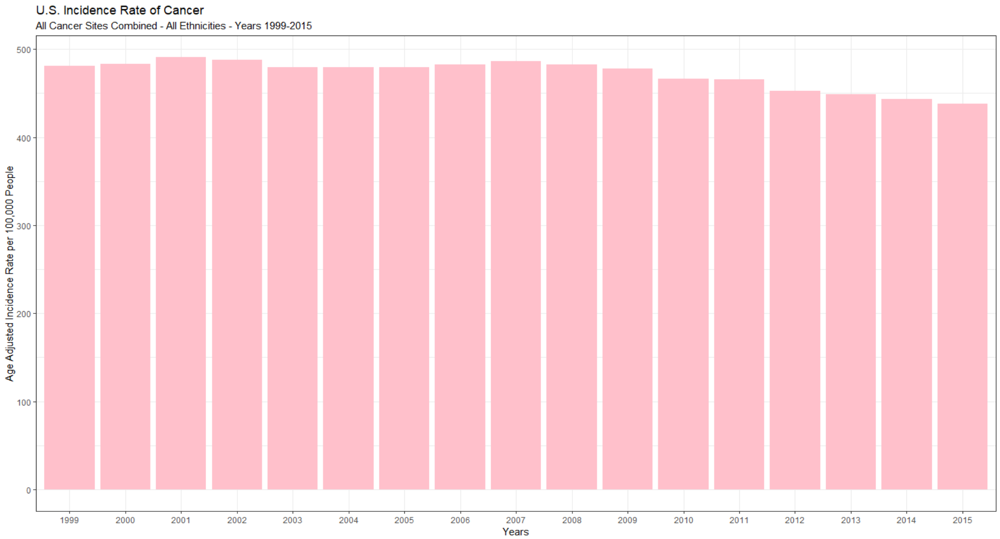\

# V. Rate of new cancers during the 1999-2015 - High Incidence Sites

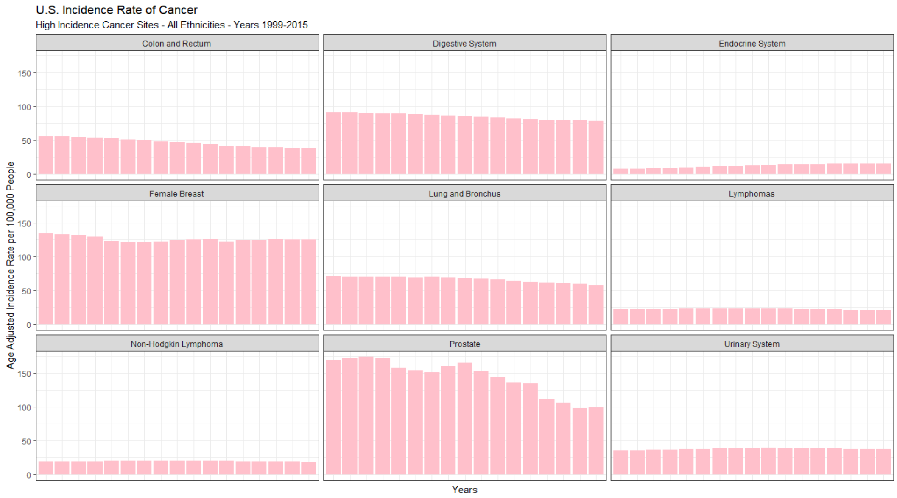\

# V. Rate of cancer mortality and incidence during the 1999-2015 - Both Sexes

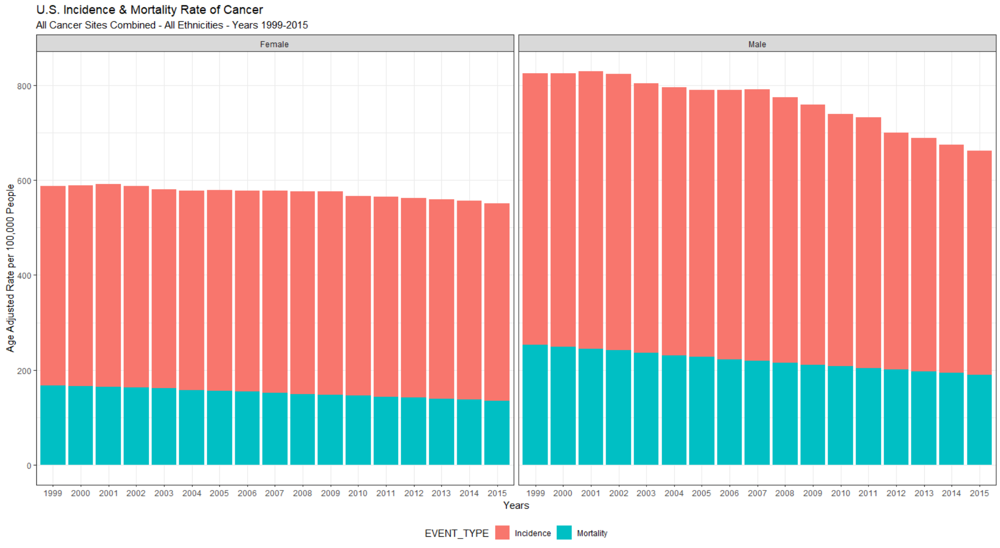\

# V. U.S. Cancer Incidence Rate 2011-2015 - Map

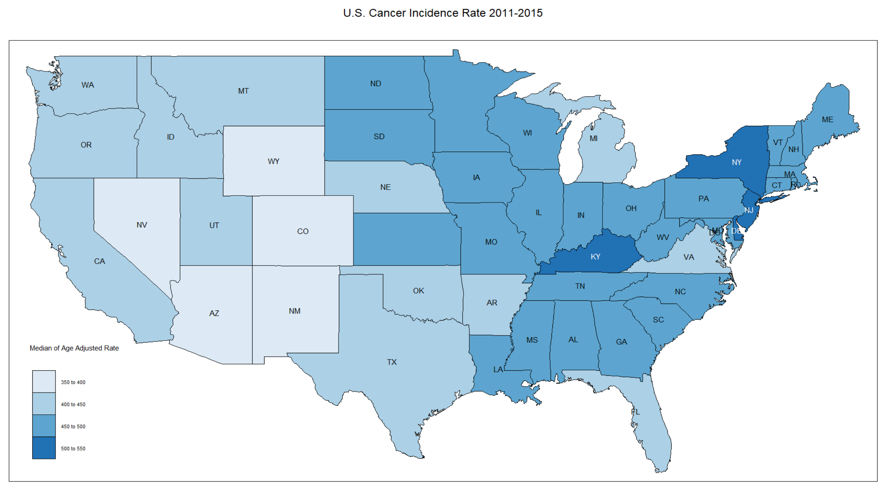\

# References

1. Zahnd, W. E., James, A. S., Jenkins, W. D., Izadi, S. R., Fogleman, A. J., Steward, D. E., . Brard, L. (2018). Rural-Urban differences in cancer incidence and trends in the United States. Cancer Epidemiology Biomarkers and Prevention. http://doi.org/10.1158/1055-9965.EPI-17-0430

2. White, M. C., Holman, D. M., Boehm, J. E., Peipins, L. A., Grossman, M., & Jane Henley, S. (2014). Age and cancer risk: A potentially modifiable relationship. American Journal of Preventive Medicine. http://doi.org/10.1016/j.amepre.2013.10.029

# References

3. Ward-Peterson, M., Acuna, J. M., Alkhalifah, M. K., Nasiri, A. M., Al-Akeel, E. S., Alkhaldi, T. M., Dawari, S. A., . Aldaham, S. A. (2016). Association Between Race/Ethnicity and Survival of Melanoma Patients in the United States Over 3 Decades: A Secondary Analysis of SEER Data. Medicine, 95(17), e3315.

4. Siegel, R. L., Miller, K. D., & Jemal, A. (2019). Cancer statistics, 2019. CA: A Cancer Journal for Clinicians. http://doi.org/10.3322/caac.21551

5. Rahbari, R., Zhang, L., & Kebebew, E. (2010). Thyroid cancer gender disparity. Future oncology (London, England), 6(11), 1771-1779. doi:10.2217/fon.10.127

